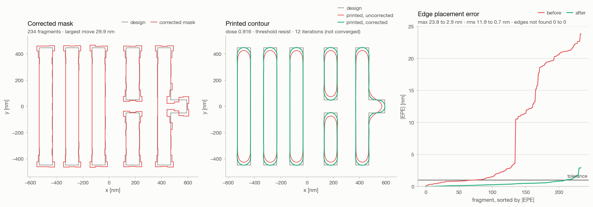
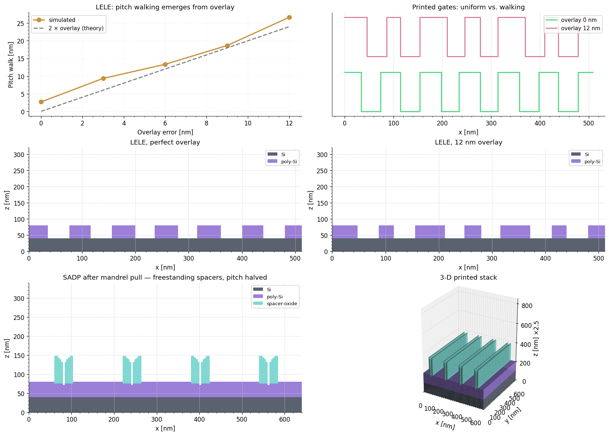
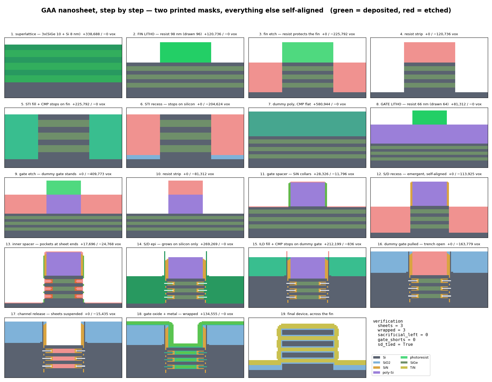
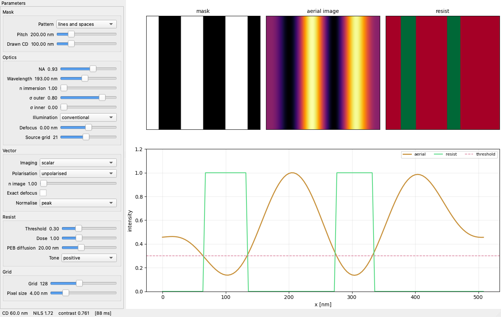
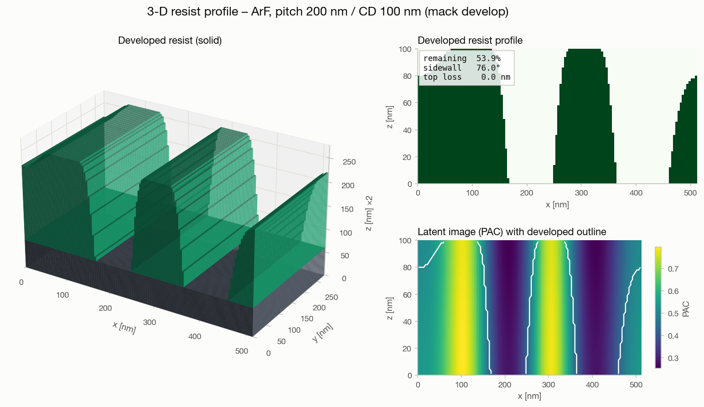
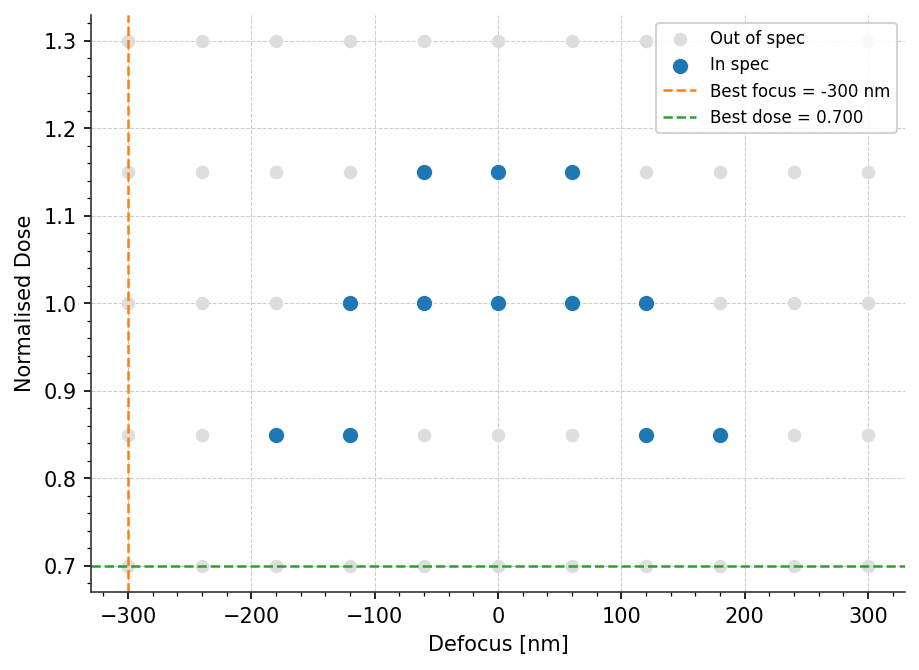
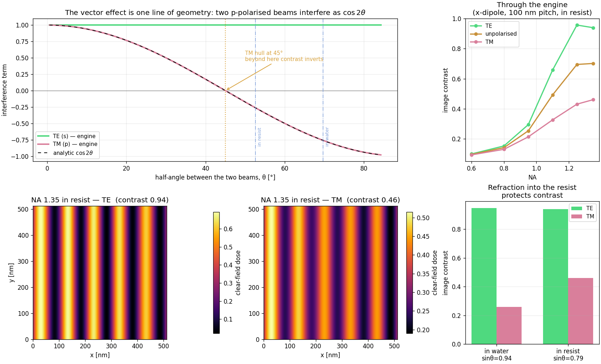

# LithoPy

**A photolithography engine that prints real devices.**

LithoPy simulates optical lithography from the drawn mask to the patterned
wafer: partially coherent imaging through a projection lens, photoresist
chemistry in three dimensions, the process steps that turn a developed resist
into structure on a voxel wafer, and the multi-patterning flows and device
recipes built out of those steps. Two printed masks and a sequence of
self-aligned steps build a gate-all-around nanosheet transistor; model-based
OPC moves the mask edges until the design prints as drawn. Every
higher-level effect — pitch walking, spacer pitch division, the etch mask,
hammerheads and serifs — is emergent from the primitives rather than coded.

The Python package is `litho_sim`; the repository is *Lithobat*.



## What it does

**Imaging.** Abbe partially coherent imaging with conventional, annular,
dipole, quadrupole and free-form sources; defocus (paraxial and exact
non-paraxial); Zernike aberrations (Noll 1–21); attenuated phase-shift
masks. A **vector** model tracks all three field components with
unpolarised, linear, azimuthal (TE) and radial (TM) illumination, which is
where hyper-NA contrast loss comes from. **Mask 3-D** effects: each
diffraction order reflected off the EUV multilayer at its own angle, or a
full complex-field FDTD solve around the absorber, validated against
Fresnel and transfer-matrix references. A **sum-of-coherent-systems** form of
the same imaging turns fixed optics into a few dozen eigen-kernels for loops
that only change the mask.

**Resist.** Dill exposure with bleaching, Gaussian post-exposure bake or full
acid/quencher reaction–diffusion, Mack dissolution, threshold development. In
3-D: depth-resolved exposure, Beer–Lambert absorption, substrate standing
waves through a transfer-matrix film stack, a vertical ray develop and an
eikonal moving front that can undercut. **Stochastics**: photon shot noise
and molecular counting propagated through the chemistry to line-edge
roughness.

**Wafer.** A voxel film stack with conformal and selective deposition,
selective and anisotropic etch with profiles, lateral etch, strip and CMP.
**Multi-patterning**: LELE, LE³, SADP, SAQP and cut/block masks with
per-exposure overlay. **Devices**: a planar nFET at 193 nm immersion and a
GAA nanosheet transistor at EUV, each built from two printed masks and
verified structurally.



**Analysis and correction.** Bossung curves, exposure latitude, depth of
focus, the process window, NILS, dose-to-size, MEEF; a CD-SEM image model
with the CD read back off it; model-based OPC with fragmentation, corner
retargeting, sub-pixel edge placement error, a mask-rule-checked iteration
and rule-based scattering bars.

**Front ends.** A command line for every feature above, and a native Qt
desktop app organised one tab per process step.

Out of scope: inverse lithography (pixel-based mask optimisation).

## Install

```bash
git clone https://github.com/bat723/Lithobat.git
cd Lithobat
python -m venv .venv && source .venv/bin/activate
pip install -e ".[dev]"            # the engine plus test tooling
pip install -e ".[app]"            # add the desktop app (PySide6, pyvista)
```

Python 3.10 or newer. Extras: `app` (desktop front end and its VTK views),
`viz` (plotly stack figure, marching-cubes meshes), `ml` (the autoencoder
defect study), `dev` (pytest, ruff, mypy). `requirements.txt` installs
`.[app,dev]` for people who reach for it.

## Quick start

```python
from litho_sim.core import SimulationConfig
from litho_sim.mask import lines_and_spaces
from litho_sim.expose import compute_aerial_image
from litho_sim.develop import simulate_resist, measure_cd_2d

cfg = SimulationConfig.from_tech_node("ArF")
mask = lines_and_spaces(cfg.grid.n_pixels, cfg.grid.pixel_size, pitch=200e-9, cd=100e-9)
aerial = compute_aerial_image(mask, cfg.optics, cfg.grid)
_, _, resist = simulate_resist(aerial, cfg.resist, cfg.grid, model="threshold")
print(f"printed CD {measure_cd_2d(resist, cfg.grid.pixel_size) * 1e9:.1f} nm")
```

Each subpackage's `__init__` is its public API: import from the package
(`litho_sim.wafer`), not the module. Everything is in SI units internally.

Presets: `i-line`, `KrF`, `ArF`, `ArF_immersion`, `EUV`; resists
`Generic Positive`, `CAR (Positive)`, `EUV CAR (Positive)`,
`Generic Negative`. Configurations are dataclasses that validate their
physics on construction — an NA above the immersion index, a coherence factor
above 1, or a misspelt model name is refused at the point you wrote it — and
round-trip through JSON with a schema version.

## The command line

`litho-sim` (or `python -m litho_sim`) has one subcommand per feature. Every
one takes `--output` and `--no-show`, and every one is also reachable as a
script under `scripts/` for the invocations the notes have always used.

| Command | What it does | Writes |
|---|---|---|
| `litho-sim demo` | one simulation: aerial image, 2-D footprint, 3-D resist profile | `aerial_image.png`, `resist_profile.png`, `resist_profile_3d.png` |
| `litho-sim bossung` | CD through focus across dose | `bossung_curves.png`, `bossung_data.csv` |
| `litho-sim window` | the process window: EL, DOF, best focus and dose, EL–DOF curve | `process_window.png`, `cd_heatmap.png`, CSVs |
| `litho-sim opc` | model-based OPC on a dense array, an isolated line, a tip-to-tip pair and a T | `opc_demo.png` |
| `litho-sim multipatterning` | LELE pitch walking versus overlay, SADP, SADP with a cut mask | `multipatterning_demo.png`, `sadp_cut_demo.png` |
| `litho-sim vector` | the polarisation effect at hyper-NA: the cos 2θ law and the images | `vector_effect.png` |
| `litho-sim device gaa` / `nfet` | build a printed device and verify it structurally; `--calibrate` sweeps dose, `--figure` draws every step | `gaa_steps.png` |

```bash
litho-sim demo --node ArF_immersion --pitch 90 --cd 45 --threshold 0.6
litho-sim window --node EUV --pitch 40 --cd 20 --tolerance 10
litho-sim opc --sraf                          # scattering bars first
litho-sim opc --node EUV --pitch 40 --cd 20 --diffusion-nm 5
litho-sim device gaa --figure results/gaa_steps.png
```



## The desktop app

```bash
python -m litho_sim.app        # or: litho-sim-app
```

One tab per processing step — Mask, Source, Resist, Expose, Bake, Develop —
each with its controls beside its picture; then Wafer Stack for a process
flow on the printed resist, Simulate to run things (a print, a 3-D profile,
a focus–exposure matrix, stochastic trials), and SEM to image what ran the
way a fab would. Nothing physical computes while a control moves; results
land on the step tabs with staleness banners. File ▸ Load device builds the
GAA or nFET preset off the GUI thread and drops it in as the starting wafer.
The two 3-D views need the `app` extra's pyvista.



## The package

```
src/litho_sim/
  core/        configs, grids, logging — everything imports downward from here
  mask/        geometry · layout · patterns          what gets printed
  opc/         fragments · model · correct · assist  moving the mask until it prints as drawn
  expose/      pupil · illumination · source · aerial_image · hopkins · m3d/
  coat/        films — TMM, BARC, swing curves       what the light lands on
  bake/        peb · reaction — diffusion, acid/quencher chemistry
  develop/     resist · resist3d · front · stochastic
  wafer/       stack · materials · etch_profile      the voxel wafer state
  patterning/  steps · flow · multipatterning · cuts recipes are data
  analysis/    process windows, Bossung, NILS, stochastics
  metrology/   sem — the CD-SEM image of a print, and the CD read off it
  tech/        gaa · nfet · flows · devices          printed devices
  viz/         plots · viz3d · theme
  cli/         one module per subcommand
  app/         the Qt front end
  ml/          the autoencoder defect study (torch optional)
```

`scripts/` holds what is not a subcommand: `opc_gallery.py` (how the OPC
verdict came about, in pictures), `render_devices_3d.py` and
`show_device.py` (the finished devices as stills or in the app),
`style_board.py` (every figure style on one page), `build_docs.py` (the
private notes), and the defect study's `generate_data.py` and
`train_model.py`.

## Physics

**Aerial image.** The mask transmittance is decomposed by a 2-D Fourier
transform; the lens is a low-pass filter of radius NA/λ; each source point
illuminates the mask at its own angle and shifts the pupil; the image is the
incoherent sum over the source (the Abbe method):

$$I(\mathbf{r}) = \sum_{\mathbf{s}} S(\mathbf{s}) \left| \mathcal{F}^{-1}\left\{ T(\mathbf{f}) \, P\!\left(\mathbf{f} - \mathbf{s}\right) \right\} \right|^2$$

The pupil carries defocus as a wavefront error — paraxial
$W = \pi \mathrm{NA}^2 \rho^2 \Delta z / (\lambda n)$ or exact
$n \Delta z (1 - \cos\theta)$ with $\sin\theta = \rho\,\mathrm{NA}/n$ — plus
Zernike terms $2\pi \sum_j c_j Z_j(\rho, \phi)$. The vector model replaces the
scalar field by three components whose weights follow from the requirement
that the field stay transverse to each ray; the polarisation-dependent
contrast loss at hyper-NA falls out of that geometry.

**Sum of coherent systems.** With the optics fixed, the same sum is
$\sum_k \lambda_k \left| \mathcal{F}^{-1}\{ \phi_k T \} \right|^2$ where
$(\lambda_k, \phi_k)$ are the eigenpairs of the transmission
cross-coefficient $\mathrm{TCC}(f, f') = \sum_s S(s) P(f - s) P^*(f' - s)$. Kept
in full it reproduces the Abbe sum to rounding; it is what the OPC print
model images through.

**Resist.** Dill exposure $M = \exp(-C\,I\,E)$; post-exposure bake as a
Gaussian blur of the latent image, or acid/quencher reaction–diffusion with
catalytic deprotection; Mack dissolution
$R = R_\max \frac{(a+1)(1-M)^n}{a + (1-M)^n} + R_\min$ with
$a = \frac{n+1}{n-1}(1-M_{th})^n$; and the threshold model, which compares
intensity to a fraction of the clear-field dose. In 3-D the aerial image is
formed at each depth with the defocus and image-space index of a plane
inside the film, attenuated by absorption, modulated by standing waves, and
developed either column by column or by a moving front that solves the
eikonal equation.



**Measurement.** CD is the sub-pixel threshold crossing of the continuous
latent field, not the width of a binarised image. NILS is
$\mathrm{CD}\,|\mathrm{d}\ln I/\mathrm{d}x|$ at the edge. The process window is
the region of dose and focus where CD holds within tolerance, with the
exposure latitude at best focus and the depth of focus at nominal dose read
off contiguous in-spec runs with interpolated crossings.




## Performance

Measured on an Apple Silicon laptop, default ArF preset, 197 source points.

| Computation | Time |
|---|---|
| Scalar aerial image, 128 px | 22 ms |
| Scalar aerial image, 256 px | 83 ms |
| Vector aerial image, 256 px | 354 ms |
| 3-D resist profile, 21 planes | 0.49 s |
| OPC print through kernels, 128 px | 6 ms |
| OPC print through kernels, 256 px | 50 ms |

The Abbe loop batches every source point's transform into one call to the
FFT library, which runs them across all cores; a depth-resolved exposure
sends all of its planes through one pass; the OPC model images through the
kernels. The source grid, not the pixel count, sets the cost of an image.

## Development

```bash
pytest                       # the whole suite, about four minutes
pytest -m "not slow"         # without the FDTD solves and device builds
ruff check src tests scripts
mypy src/litho_sim
```

Continuous integration runs the same three on pushes and pull requests,
across Python 3.10, 3.12 and 3.13, plus the sibling project's tests.

Two rules that make the engine testable are worth knowing. Nothing computes
the interesting effects: pitch walking, pitch division, etch masking and
line-end pullback all fall out of primitives, so a test asserts a physical
outcome and cannot be satisfied by special-casing. And every print goes
through one definition of "what printed" — a continuous field and the level
whose crossing is the resist edge — shared by the process window, the OPC
model and the app, so no two of them can disagree about a CD.

## The defect study

The `ml` extra keeps the project's original experiment: a convolutional
autoencoder trained on clean aerial images and used to flag defective ones
by reconstruction error. `scripts/generate_data.py` renders clean and
defective images (particles, line roughness, bridges) with the engine, and
`scripts/train_model.py` trains against `configs/train_config.yaml`. It is
self-contained and optional; the engine does not depend on it.

## Sibling project

`wafer-metrology-engine/` is a separate package for wafer surface metrology
— flatness, Zernike decomposition, deflectometry, interferometry, defect
maps, gauge R&R — with its own `pyproject.toml` and tests, run by the same
CI. It shares no code with the lithography engine.

## References

- C. A. Mack, *Fundamental Principles of Optical Lithography: The Science of Microfabrication*, Wiley, 2007.
- H. H. Hopkins, "On the diffraction theory of optical images", *Proc. R. Soc. A* 217 (1953).
- F. H. Dill et al., "Characterization of positive photoresist", *IEEE Trans. Electron Devices* 22 (1975).
- N. B. Cobb, *Fast Optical and Process Proximity Correction Algorithms for Integrated Circuit Manufacturing*, PhD thesis, UC Berkeley, 1998 (the sum of coherent systems).
- R. J. Noll, "Zernike polynomials and atmospheric turbulence", *J. Opt. Soc. Am.* 66 (1976).

## License

MIT — see `LICENSE`.
