# wafer-metrology-engine

**Wafer surface metrology and warpage characterisation for silicon-photonics packaging.**

A metrology-side companion to the [LithoPy](../README.md) forward imaging engine. Where LithoPy answers *what prints*, this package answers *where the surface actually is*: the bow, warp, thickness variation and site flatness that set a scanner's focus budget and a packaged photonic die's fibre-coupling yield.

The pipeline runs end to end on synthetic data — synthesise a wafer, decompose its shape into Zernike terms, measure it (phase-shifting interferometry *and* phase-measuring deflectometry), report SEMI flatness, extract defects two independent ways, qualify the gauge with a Gage R&R study, and finally price the measured warp in dB of fibre-attach penalty.

```
synthesize ─▶ zernike ─▶ interferometry ─▶ flatness ─▶ defects ─▶ doe
   wafer       shape    ─▶ deflectometry ──▶ metrics    inspect    R&R
                              Leg A                                 │
                        reversal + flat cal ─────────▶ coupling ◀───┘
                                                       capstone: warp → dB
```

The package doubles as the **Tier-0 software engine for the physical
deflectometry station build** (150 mm wafers, laptop-screen fringes, 1550 nm
fibre bench): the deflectometry module implements the rig's exact forward and
inverse chain and validates it on synthetics far past the plan's <1 % gate.
See [`docs/hardware-plan-notes.md`](docs/hardware-plan-notes.md) for the
build-spec review, the corrections ledger (including the reversal-calibration
parity fix), and the engine-to-hardware mapping table.

---

## Contents

1. [Purpose](#1-purpose)
2. [Apparatus and assumptions](#2-apparatus-and-assumptions)
3. [Installation](#3-installation)
4. [Method](#4-method)
   - [4.1 Wafer synthesis](#41-wafer-synthesis-synthesizepy)
   - [4.2 Zernike decomposition](#42-zernike-decomposition-zernikepy)
   - [4.3 Interferometry](#43-interferometry-interferometrypy)
   - [4.4 Flatness metrology](#44-flatness-metrology-flatnesspy)
   - [4.5 Defect extraction](#45-defect-extraction-defectspy)
   - [4.6 DOE and Gage R&R](#46-doe-and-gage-rr-doepy)
   - [4.7 Deflectometry](#47-deflectometry-deflectometrypy)
   - [4.8 Coupling and the capstone](#48-coupling-and-the-capstone-couplingpy)
5. [Analysis: results from a reference run](#5-analysis-results-from-a-reference-run)
6. [Repeatability and gauge capability](#6-repeatability-and-gauge-capability)
7. [How to run](#7-how-to-run)
8. [Testing](#8-testing)
9. [Design notes and known limits](#9-design-notes-and-known-limits)
10. [References](#10-references)

---

## 1. Purpose

In silicon-photonics packaging a fibre must land on a waveguide facet with sub-micron accuracy. Wafer shape decides how far the die surface wanders from the plane the aligner assumes:

| Quantity | What it controls |
|---|---|
| **Warp / bow** | Chuck-to-chuck variation and handling stress; the gross shape a tool must flatten out |
| **TTV** | Backside-referenced standoff; thickness error propagates directly into focus |
| **SFQR** | Height variation *within* one exposure field — what a scanner **cannot** refocus away |
| **Nanotopography** | Residual mid-spatial-frequency roughness, and CMP dishing signature |

This package computes all of them from a simulated measurement rather than from ground truth, so the numbers carry realistic measurement error — and then quantifies that error.

**Scope.** Everything here runs on synthetic wafers. There is no instrument driver and no file-format reader; `synthesize.py` stands in for the tool. Swap it for a real height map (metres, `NaN` outside the aperture) and the rest of the pipeline is unchanged.

---

## 2. Apparatus and assumptions

**Simulated apparatus**

| Item | Value |
|---|---|
| Wafer | 300 mm diameter, 775 µm nominal thickness (SEMI M1) |
| Grid | Square, circular aperture inscribed; 512 px default → 0.586 mm/px |
| Interferometer | Reflection phase-shifting, 4 steps over 2π |
| Sources | HeNe 632.8 nm; synthetic 56.2 µm from a 632.8 / 640.0 nm pair |
| Detector | Additive Gaussian noise, 1 % of mean intensity by default |
| Exposure site | 25 × 25 mm, 3 mm fixed quality area edge exclusion |

**Assumptions**

- Height maps are in **metres** throughout, with `NaN` outside the circular aperture. Only names ending `_nm`, `_um`, `_mm`, `_pct` depart from SI.
- The interferometer is a **phase** instrument: it sees `4πz/λ` and nothing else. It measures one face, so it cannot report TTV — that needs both surfaces.
- Optics are ideal: no retrace error, no reference-surface figure error, no vibration. The two error sources modelled are detector noise and phase-step miscalibration, because those are the ones a DOE can excite.
- Every RNG is seeded. A given `(seed, n_pixels)` reproduces a wafer exactly; changing the grid size changes the random draws, so seeds are reproducible per grid, not across grids.

---

## 3. Installation

```bash
cd wafer-metrology-engine
python -m venv .venv && source .venv/bin/activate
pip install -e ".[dev]"
```

**Required:** `numpy`, `scipy`, `pandas`, `matplotlib`.

**Optional extras**

| Extra | Adds | Effect if missing |
|---|---|---|
| `[image]` | `scikit-image` | Bundled scipy fallbacks are used instead — see below |
| `[ml]` | `torch` | The autoencoder defect path is skipped; everything else runs |

**On the scikit-image fallbacks.** `unwrap_phase`, `label` and `regionprops` are used when scikit-image is installed. When it is not, the package uses bundled equivalents built on scipy: a DCT least-squares (Ghiglia–Romero) phase unwrapper with a congruence correction, and an `ndimage`-based region-properties table with identical columns. Both paths are exercised by the test suite, and `wafer_metrology.interferometry.HAVE_SKIMAGE` reports which is active. The fallback unwrapper is approximate within about one pixel of the aperture edge, where it extends the phase by nearest-neighbour fill.

---

## 4. Method

### 4.1 Wafer synthesis (`synthesize.py`)

Superposes four contributions on a circular aperture:

1. **Parabolic bow** — `sag·(ρ² − ½)`, zero-mean over the disk so it adds shape but no piston.
2. **Warp lobes** — astigmatism, coma and trefoil at random phases. These are what a least-squares plane *cannot* remove, and they dominate residual warp on a bonded or heavily-filmed wafer.
3. **Nanotopography** — Gaussian-filtered white noise scaled to a target RMS (18 nm over a 3 mm correlation length by default).
4. **Defects** — particles as Gaussian bumps, scratches as line features with a Gaussian cross-section, both recorded as ground truth so detection can be scored.

`synthesize_wafer_pair` additionally builds a back surface with an independent thickness field, because the SEMI definitions need both faces.

```python
from wafer_metrology.synthesize import synthesize_wafer_pair

pair = synthesize_wafer_pair(n_pixels=512, seed=0)
x, y, z, mask = pair.front          # WaferSurface unpacks as a 4-tuple
```

### 4.2 Zernike decomposition (`zernike.py`)

Zernike polynomials are orthogonal on a circular aperture, so they are the natural basis for a wafer, and their low orders map one-to-one onto the terms metrology cares about.

- **Convention:** ANSI/OSA `(n, m)` indexing, `j = (n(n+2)+m)/2`. Positive `m` is the cosine lobe.
- **Normalisation:** orthonormal, `mean(Z²) = 1` over the disk. A coefficient therefore *is* the RMS height that term contributes, coefficients add in quadrature, and the bar chart reads as a shape error budget.
- **Flattening** removes piston (Fringe Z1, an arbitrary datum), tilt (Z2/Z3, chucking) and optionally power (Z4, the bow a scanner focuses out).

```python
from wafer_metrology.zernike import fit_surface, flatten

fit = fit_surface(pair.front, nmax=6)      # 28 terms
flattened, _ = flatten(pair.front, remove_power=True)
```

### 4.3 Interferometry (`interferometry.py`)

Forward: `I_k = I₀(1 + V·cos(φ + δ_k)) + noise`, with `φ = 4πz/λ`.
Inverse: least-squares fit of `a + b_c·cos δ + b_s·sin δ` per pixel, then unwrap, then `z = λφ/4π`.

The estimator solves the general three-parameter problem rather than assuming uniform steps, so a miscalibrated actuator can be corrected exactly by passing the steps it really took. Reconstruction deliberately uses the **nominal** steps — the ones the tool believes it took — so step error shows up as real measurement error, as it would on an instrument.

**The sampling limit governs everything.** Unwrapping works only while phase changes by less than π between adjacent pixels — under **λ/4 of height per pixel**. A 300 mm wafer with 48 µm PV violates this by 6× at 633 nm:

| Wavelength | Worst step | Unwrappable? | Height noise at 1 % detector noise |
|---|---|---|---|
| HeNe 633 nm | 8.0 rad/px | ✗ aliased | — |
| Synthetic 56.2 µm | 0.09 rad/px | ✓ | ~35 nm |
| HeNe 633 nm, shape removed | 0.39 rad/px | ✓ | ~0.2 nm |

That is the real trade: a synthetic wavelength `Λ = λ₁λ₂/|λ₁−λ₂|` buys `Λ/λ` more unambiguous range and pays for it with exactly `Λ/λ` more height noise. `check_sampling` reports the margin and `measure_surface` warns when it is exceeded, rather than silently returning a wrapped mess.

### 4.4 Flatness metrology (`flatness.py`)

| Parameter | Definition |
|---|---|
| **bow** | Signed centre deflection of the **median** surface from its least-squares reference plane |
| **warp** | Peak-to-valley of the median surface about that plane; always ≥ \|bow\| |
| **TTV** | Range of `z_front − z_back` |
| **sori** | Range of the **front** surface about its own reference plane |
| **SFQR** | Site Front least-sQuares Range: per site, the range about a plane fitted to that site alone |

**Why the median surface.** Bow and warp describe *shape* and must not be contaminated by *thickness*. The median surface `(front + back)/2` is where a wafer of zero thickness variation would sit, so thickness cancels exactly; TTV is pure thickness and carries no shape. Keeping the two apart is the entire point of the SEMI definitions, and the test suite pins it: changing the thickness field leaves bow and warp bit-identical.

Sites are tiled on a 25 mm pitch with one site centred on the wafer centre. A site counts as **complete** only when its whole square lies inside the quality area. All site planes are fitted at once through batched normal equations rather than a Python loop over sites.

### 4.5 Defect extraction (`defects.py`)

**Classical path.** Flatten the shape, high-pass away the nanotopography, threshold the residual, label, measure. Two details do the heavy lifting:

- The background is a Gaussian-weighted **local plane** fit, not a weighted mean. Near the aperture edge the window is truncated on one side; a *mean* there averages an asymmetric neighbourhood of a sloped surface and returns a background biased by roughly `slope × window offset`. In testing that printed a false ring of "defects" 5–11 mm in from the edge, with a median residual of 102 nm against 13 nm in the interior. A local *plane* is unbiased under truncation and removes the ring entirely.
- Thresholding is **hysteretic** — seed at 5σ, grow at 2.5σ. A single hard cut chopped a shallow scratch into four separate "defects" wherever it dipped below the threshold.

Noise sigma is estimated by MAD, not standard deviation, so large defects cannot inflate the threshold meant to find them.

**Learned path (optional).** A convolutional autoencoder trained on clean wafers only; reconstruction error is the anomaly signal. Three things decide whether it works:

- **A narrow bottleneck.** A purely convolutional stack compresses a 32×32 tile about two-fold — ample capacity to reproduce a defect faithfully, and a defect the model reconstructs well produces no signal. A 16-number linear bottleneck (64×) forces it onto the smooth manifold.
- **Matched training data.** Reference wafers go through the same interferometric measurement as the wafer under test. Trained on noise-free truth and scored on a noisy reconstruction, the model flags either everything or nothing.
- **Pooled, log-space thresholding.** A per-pixel squared error is a 1-dof chi-square — its background spread swamps the threshold even though defects stand 400× above the noise floor. Pooling over ~1 px and thresholding `log(score)` drops the robust sigma about four-fold and takes the strongest defect from 3σ to over 10σ.

### 4.6 DOE and Gage R&R (`doe.py`)

A crossed **part × operator × trial** design over the full pipeline:

- **part** — a distinct wafer (real variation the gauge must resolve),
- **operator** — a distinct phase-step calibration error (a bias on every measurement that operator takes),
- **trial** — a repeat differing only in detector noise seed.

Variance components come from the standard crossed ANOVA (AIAG MSA), with parts and operators tested against the interaction and negative variance estimates clamped to zero. `export_for_jmp` writes the long-format runs for JMP's Variability/Gauge platform.

### 4.7 Deflectometry (`deflectometry.py`)

The hardware station's actual modality: a camera views the reflection of a
fringe screen *in* the specular wafer, so fringes encode **slope**
(`Δφ = 4π·d_s·s/p`) and height comes from integrating two slope maps — no
reference optic, a laptop screen as the source.

- **Forward model**: screen coordinate `u = x + 2·d_s·(s + e)`, programmable
  display gamma, camera noise, and an injectable *system* height field `e`
  (screen bow + pose error, fixed in the instrument frame) so calibration can
  be tested against known truth.
- **Inverse**: the general N-step phase estimator → hierarchical multi-period
  temporal unwrap (coarse period absolute, finer periods only resolve their
  own fringe order — no spatial unwrapping) → slope maps → **zonal
  least-squares integration** on the masked aperture (sparse Laplacian solve;
  exact on a circular mask, unlike periodic-domain FFT integrators).
- **Gamma**: 8-step shifting aliases only harmonics 7 and 9 of a
  gamma-distorted fringe, so an uncorrected γ = 2.2 costs < 1 mrad of phase;
  4-step admits the 3rd harmonic and is ~180× worse. The LUT calibration
  (`fit_gamma`, signal-weighted against the noisy dark levels) is provided and
  exercised, but 8 steps is the real defence.
- **Calibration, with its parity math stated honestly**:
  `reversal_calibrate` (measure, rotate the wafer 180°, re-measure) separates
  only the rotation-*odd* half of the systematic — power and astigmatism, i.e.
  a bowed screen, survive into the wafer estimate. `absolute_calibrate`
  (subtract a reference-flat measurement) removes both halves. The pipeline
  demonstrates the difference: 5.50 µm raw → 4.41 µm after reversal →
  **8 nm** after flat subtraction.

### 4.8 Coupling and the capstone (`coupling.py`)

Gaussian fibre-coupling models for SMF-28 at 1550 nm (w₀ = 5.2 µm): lateral
(`4.343 (d/w₀)²`), angular (θ₀ = λ/πw₀ ≈ 95 mrad), exact Gaussian gap
(`η = 1/(1+(z/2z_R)²)`, z_R ≈ 55 µm), the combined lateral+gap form (verified
against a numerical overlap integral), and the UPC-endface etalon ripple
(0.61 dB pk-pk at R = 3.5 %). `fit_lateral_scan` reduces a measured ±10 µm
scan to a fitted w₀ with uncertainty.

`attach_loss_budget` is the capstone: tile the **measured** height map into
die footprints, fit each site's plane (tilt + standoff vs. the global
reference plane), map through the coupling model, and report the per-site
penalty — "a wafer of this measured warp costs X dB at the worst site, Y dB
median."

---

## 5. Analysis: results from a reference run

`python run.py` with the default seed, 512 px grid, 1 % detector noise.

### Wafer and shape

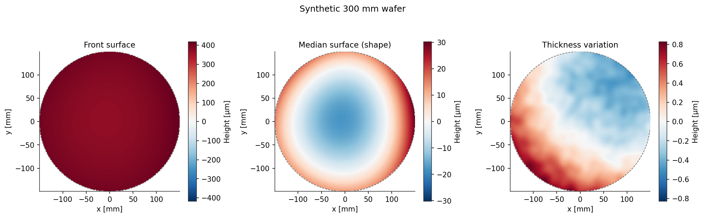

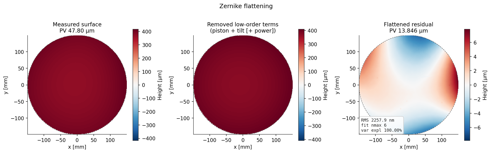

28 Zernike terms explain 99.999 % of the surface variance. The error budget is bow-dominated:

| Term | RMS contribution |
|---|---|
| Z(2,0) power | +10.15 µm |
| Z(1,1) tilt x | +2.35 µm |
| Z(2,2) astig 0° | +1.98 µm |
| Z(3,3) trefoil x | +0.80 µm |

Removing piston, tilt and power takes PV from **47.7 µm to 13.7 µm** — the rest is warp lobes a plane cannot reach.

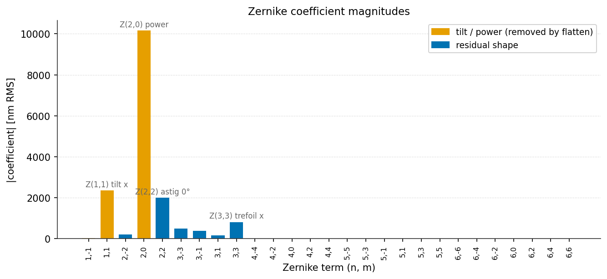

### Measurement

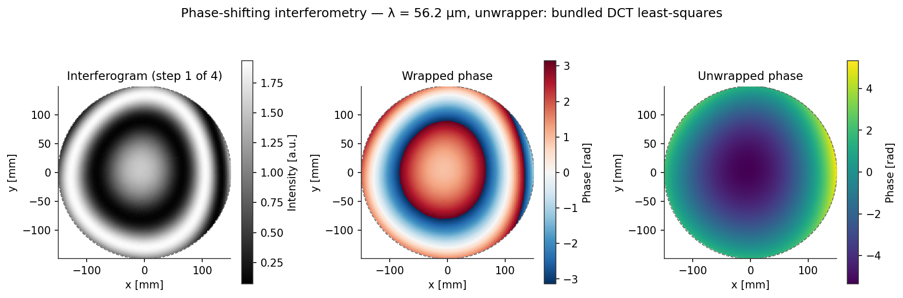

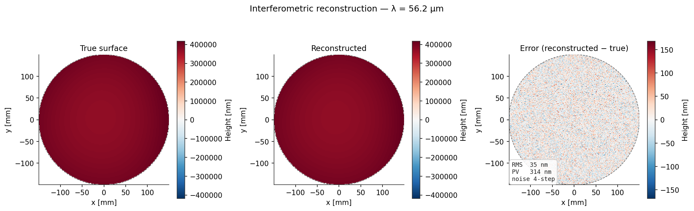

Full-wafer reconstruction at the 56.2 µm synthetic wavelength: **35.2 nm RMS error**, 353 nm PV error, on a surface with 47.7 µm of PV.

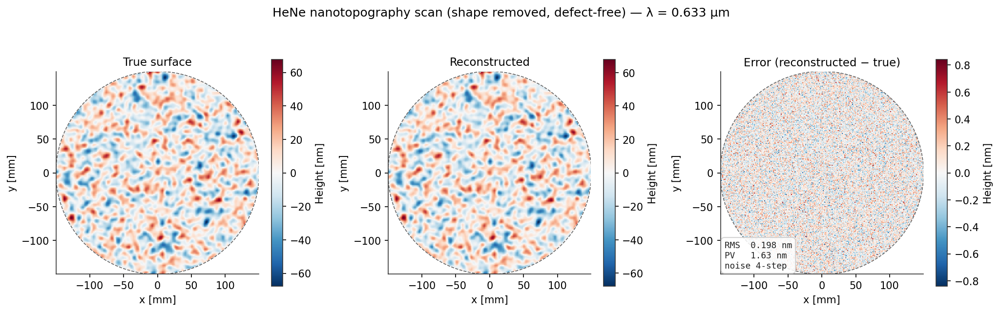

The same instrument at 633 nm, on a shape-removed defect-free wafer, measures **18.05 nm RMS of nanotopography to 0.198 nm RMS error** — a ~180× resolution gain, available only because the surface is now smooth enough to unwrap.

### Flatness

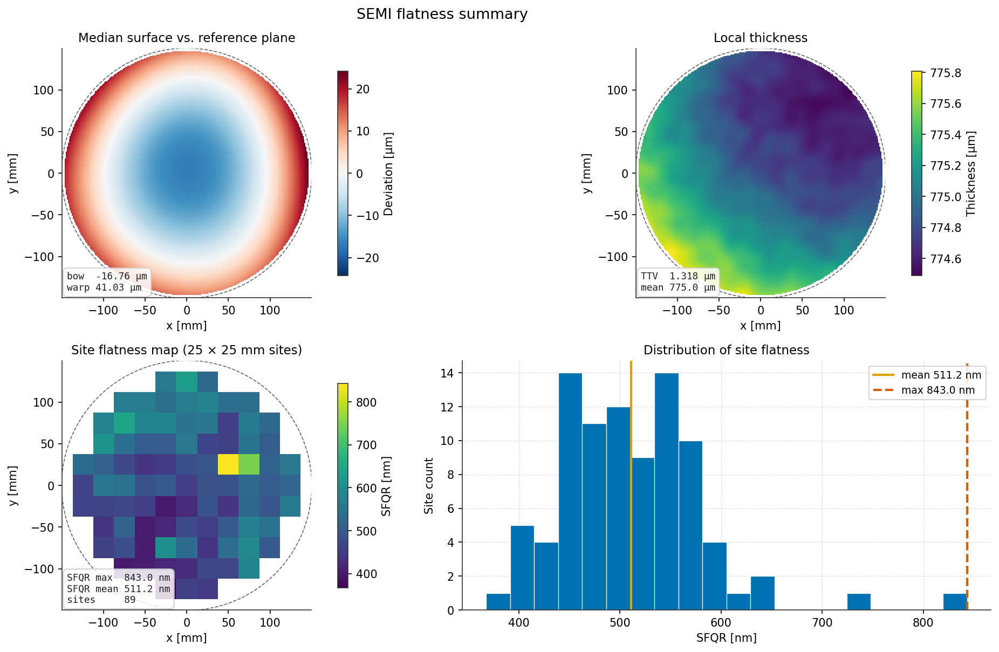

Truth versus the interferometric measurement — the gap is metrology error, not wafer variation:

| Parameter | Truth | Measured | Unit |
|---|---|---|---|
| Bow | −16.813 | −16.860 | µm |
| Warp | 41.082 | 41.257 | µm |
| TTV | 1.281 | — | µm |
| Sori | 41.165 | 41.257 | µm |
| SFQR max | 874.2 | 930.7 | nm |
| SFQR mean | 553.8 | 663.0 | nm |
| Thickness | 774.99 | — | µm |

89 complete sites. TTV and thickness are blank in the measured column because a reflection interferometer sees one face — reporting them anyway would be a fabrication.

Note that measured SFQR *mean* is 20 % high: site flatness is a range statistic, and measurement noise can only ever widen a range. Ranges are biased upward by noise; that bias is a property of the metric, not a bug.

### Defects

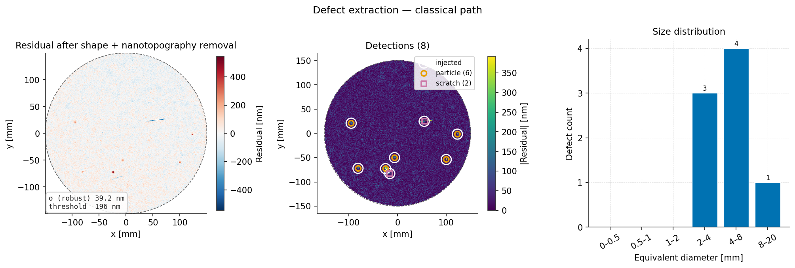

Classical path on the reconstructed surface: robust σ 39.6 nm, threshold 197.7 nm, **8 detections, 8/8 injected defects recovered, no false positives**, and both scratches correctly classified by elongation.

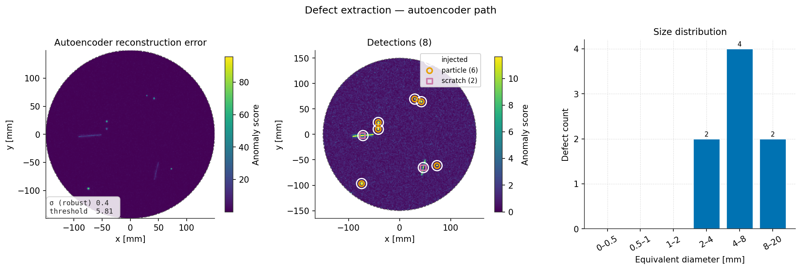

The unsupervised autoencoder, which never saw a defect in training, independently returns **8 detections and 8/8 recall**.

### Deflectometry (the hardware-matched leg)

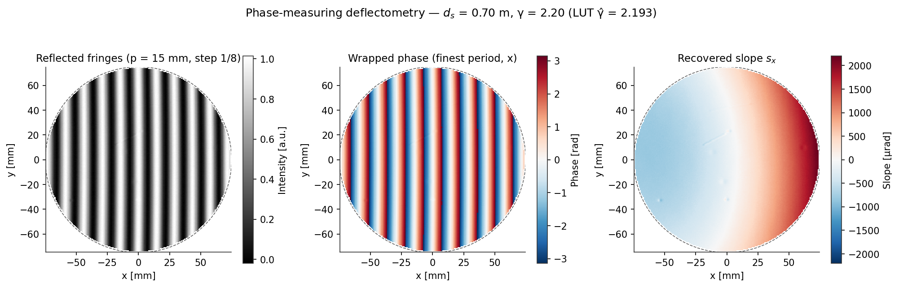

A 150 mm wafer on the planned rig (d_s = 0.7 m, 15 mm fringes, 8 steps, γ = 2.2 calibrated to 2.193), with a 32 µm-PV screen-bow-plus-pose systematic injected on purpose:

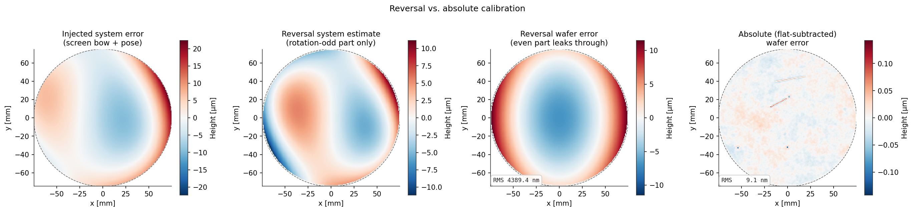

| Estimate | Wafer error (RMS) |
|---|---|
| Raw measurement | 5.50 µm |
| After rotation-reversal | 4.41 µm — the rotation-even screen bow survives, as parity demands |
| After flat subtraction | **8 nm = 0.075 %** of surface RMS (Tier-0 gate: < 1 %) |

Bow recovered to 0.01 µm, warp to 0.01 µm, SFQR max to 10 nm on 13 complete 25 mm sites.

### Capstone: the measured warp, priced

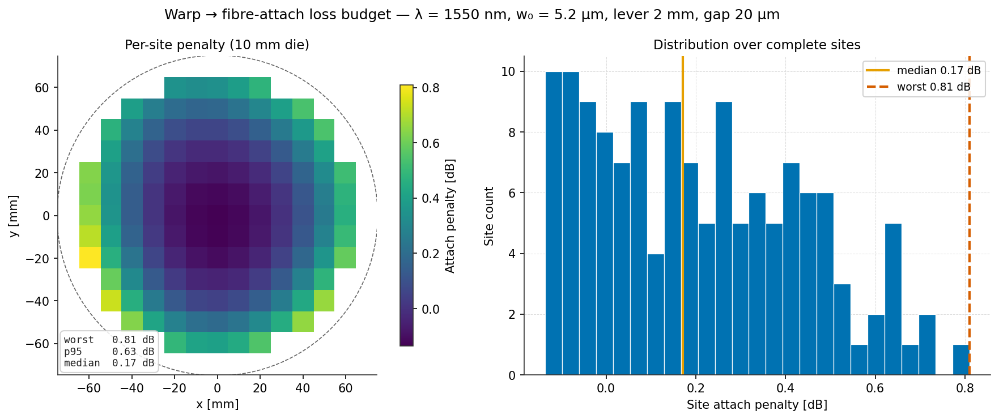

The calibrated height map, tiled into 10 mm die sites and pushed through the coupling model (2 mm lever, 20 µm nominal gap): **worst site 0.81 dB, median 0.18 dB**. Mechanism ranking: lateral (tilt × lever) 0.59 dB ≫ gap/standoff 0.22 dB ≫ angular 0.0004 dB — the divergence cone is ~95 mrad, so warp-scale tilt is harmless *directly* and expensive only through the lever arm and standoff it induces.

---

## 6. Repeatability and gauge capability

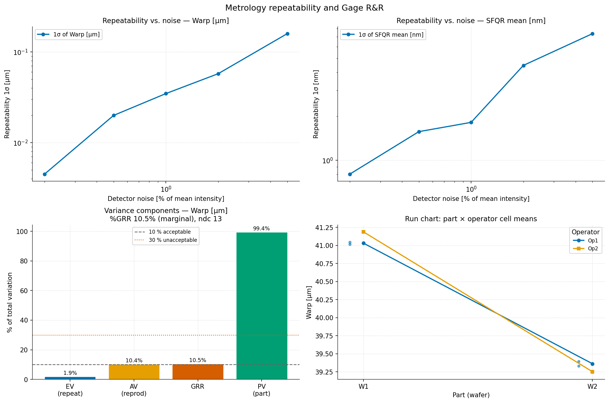

Repeatability scales linearly with detector noise, as the phase-noise model predicts:

| Detector noise | Warp 1σ | SFQR mean 1σ | SFQR max 1σ |
|---|---|---|---|
| 0.2 % | 0.006 µm | 0.77 nm | 9.7 nm |
| 1.0 % | 0.047 µm | 3.17 nm | 42.4 nm |
| 5.0 % | 0.174 µm | 10.18 nm | 55.5 nm |

Gage R&R over 3 wafers × 3 operators × 3 trials:

| Response | EV | AV | GRR | PV | %GRR | ndc | Verdict |
|---|---|---|---|---|---|---|---|
| Warp [µm] | 0.035 | 0.074 | 0.082 | 1.293 | **6.3 %** | 22 | acceptable |
| Bow [µm] | 0.012 | 0.009 | 0.015 | 0.032 | 43.1 % | 2 | unacceptable |
| SFQR max [nm] | 36.0 | 47.7 | 59.7 | 52.0 | 75.4 % | 1 | unacceptable |
| SFQR mean [nm] | 3.1 | 8.1 | 8.7 | 5.3 | 85.6 % | 0 | unacceptable |

**Reading this honestly.** Only warp passes, and the failures are informative rather than embarrassing:

- **%GRR is a ratio, not an absolute.** Bow fails not because it is measured badly — its gauge error is 15 nm — but because these three wafers happen to have nearly identical bow (PV 32 nm). A gauge is only "capable" relative to the spread it must resolve. Widen the part set and bow passes.
- **SFQR max is an extreme-value statistic** over ~90 sites, so it inherits the worst noise excursion anywhere on the wafer. It is jumpy by construction. This is a concrete argument for monitoring a robust statistic instead of a maximum — which is precisely the kind of conclusion a Gage R&R study exists to produce.

---

## 7. How to run

```bash
python run.py                      # full run, 512 px, ~25 s
python run.py --quick              # smaller grids and DOE, no autoencoder, ~8 s
python run.py --n-pixels 768 -v    # finer grid, debug logging
python run.py --no-doe --no-ml     # figures and flatness only
python run.py --no-deflectometry   # skip Leg A + capstone
python run.py --help
```

Or from Python:

```python
from wafer_metrology.pipeline import run_pipeline

result = run_pipeline("results", n_pixels=512, seed=0)
print(result.flatness_true.metrics.to_frame())
print(f"reconstruction error {result.rms_reconstruction_error * 1e9:.1f} nm")
```

`notebooks/demo.ipynb` walks the same pipeline with inline figures and commentary.

**Outputs** (all written to `results/`)

| File | Contents |
|---|---|
| `01`–`14_*.png` | Figures, in pipeline order (11–14 are deflectometry + capstone) |
| `flatness_metrics.csv` | Summary metric table |
| `site_flatness.csv` | Per-site SFQR, one row per site |
| `defects.csv` | Defect inventory with physical coordinates |
| `gauge_rr_components.csv` | Variance components per response |
| `doe_runs_for_jmp.csv` | Long-format runs for JMP |
| `noise_sweep.csv` | Raw repeatability sweep |
| `loss_budget.csv` | Per-site fibre-attach penalty (capstone) |

---

## 8. Testing

```bash
pytest                       # 137 tests, ~6 s
pytest --cov=wafer_metrology
```

Tests check physics against closed-form results wherever one exists, not just that the code runs:

| Test | Checks against |
|---|---|
| Zernike orthonormality | Gram matrix ≈ identity over the disk |
| Zernike round trip | Known coefficients recovered to 2 nm; residual orthogonal to the basis |
| Bow and warp | Analytic paraboloid: `bow = −aR²/2`, `warp = aR²`, recovered to 0.02 % |
| Thickness independence | Changing the thickness field leaves bow and warp bit-identical |
| SFQR tiling | Site centres on pitch; planar surface → SFQR < 1e-15 |
| SFQR magnitude | Analytic quadratic: `SFQR = a·s²/4`, recovered to 3 % |
| Phase unwrap | Round trip to 1e-6 rad; offset is exactly a whole fringe order |
| Measurement | Noiseless round trip < 1 pm; error linear in noise and wavelength |
| Gage R&R | Known variance components recovered to 10–20 % |
| Slope integration | Analytic surface reintegrated to < 0.5 % on the masked disk |
| Temporal unwrap | Exact on a multi-period ramp; no order slips at realistic phase noise |
| Gamma harmonics | 4-step admits the 3rd harmonic, 8-step suppresses it > 20× (phase-level test) |
| Reversal parity | Odd systematic captured to nm; even systematic shown leaking in full; flat subtraction recovers < 1 % |
| Coupling models | Plan's dB thresholds pinned; combined formula vs numerical overlap integral < 0.02 dB |
| Capstone | Flat wafer → 0 dB; lever-arm monotonicity; angular term negligible at warp scale |

The interferometry tests parametrise over both unwrapping back-ends when scikit-image is installed, so the fallback is never untested.

---

## 9. Design notes and known limits

**Deliberate choices**

- **Docstrings are NumPy-style**, matching the ~7,000-line LithoPy codebase this extends, rather than Google style.
- **`WaferSurface` unpacks as `x, y, z, mask`** via `__iter__`, so the documented 4-tuple contract holds while still carrying grid metadata and defect truth.
- **Per-site and per-pixel plane fits are batched**, not looped: `bincount` moments plus one stacked `solve`. A whole wafer of sites costs a handful of array passes.
- **Solvability is tested by singular values, not determinants.** A near-collinear sliver site has a tiny but non-zero determinant, which `solve` either rejects or answers with garbage.

**Limits**

- Everything is synthetic; there is no instrument I/O or file-format support.
  (For the hardware build, the capture glue — `pypylon` scripts, real
  gamma/pose calibration — lives outside this package; the reduction it feeds
  is what's implemented and tested here.)
- The interferometer model omits retrace error, reference-surface figure error and vibration.
- The deflectometry forward model is paraxial and screen-parallel: perspective,
  oblique viewing and screen pose are absorbed into the injectable system
  field rather than modelled geometrically — on the bench they are handled by
  the checkerboard/pose calibration and the flat subtraction.
- Deflectometry height maps carry no absolute piston (slopes cannot see it);
  every comparison is plane-referenced, matching the SEMI metrics.
- Defect classification is a two-way elongation/sign heuristic, not a trained classifier.
- Site flatness implements SFQR only. SBIR, ESFQR and the full SEMI site-layout options are not implemented.
- The bundled phase unwrapper is approximate within ~1 px of the aperture edge.
- Seeds reproduce a wafer for a given grid size; changing `n_pixels` changes the random draws.

---

## 10. References

- SEMI M1 — *Specification for Polished Monocrystalline Silicon Wafers* (bow, warp, TTV, site flatness definitions).
- SEMI M43 — *Guide for Reporting Wafer Nanotopography*.
- D. C. Ghiglia and L. A. Romero, "Robust two-dimensional weighted and unweighted phase unwrapping that uses fast transforms and iterative methods", *JOSA A* **11**, 107 (1994).
- K. Creath, "Phase-Measurement Interferometry Techniques", *Progress in Optics* **26**, 349 (1988).
- R. J. Noll, "Zernike polynomials and atmospheric turbulence", *JOSA* **66**, 207 (1976).
- AIAG, *Measurement Systems Analysis (MSA)*, 4th ed. — Gage R&R by the ANOVA method.
- C. Mack, *Fundamental Principles of Optical Lithography* — focus budget and its relation to wafer flatness.

---

## License

MIT, matching the parent project.
